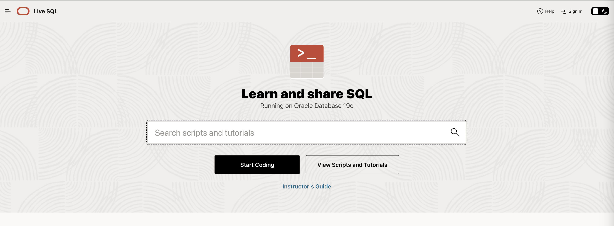
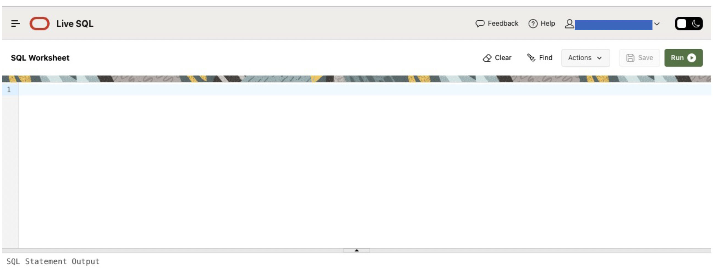
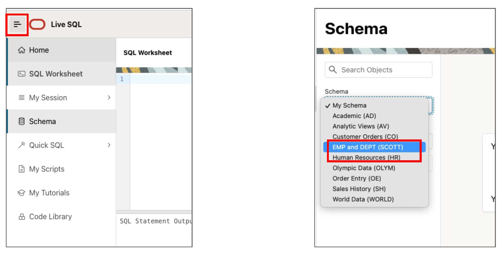
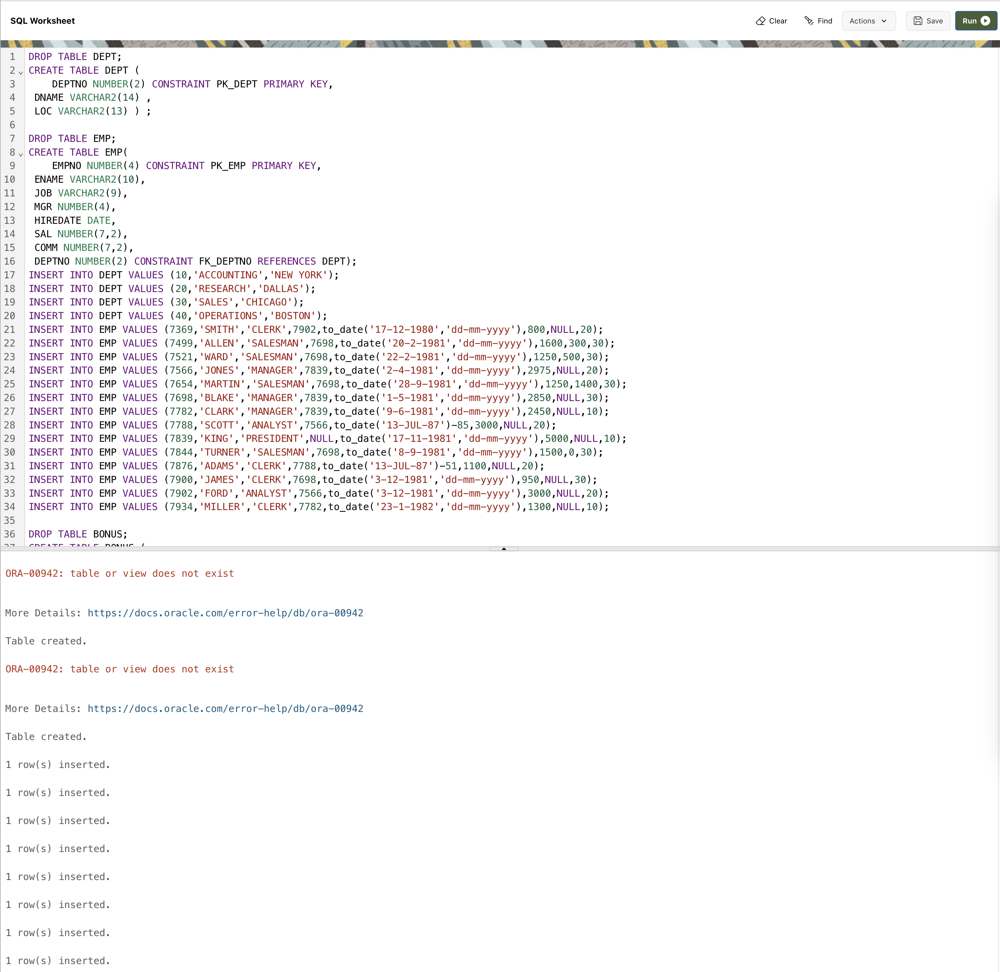
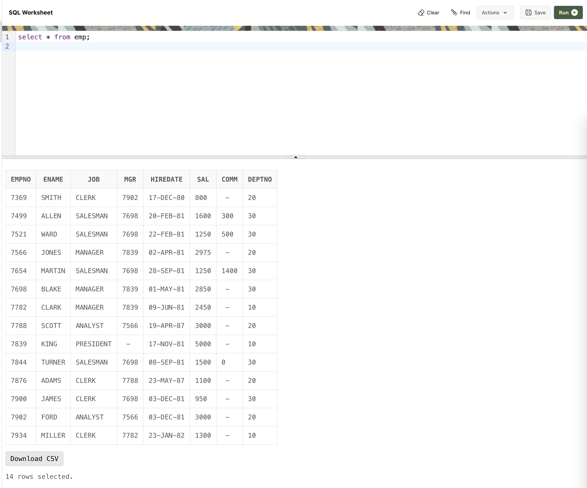

# Oracle Live SQL

- Oracle Live SQL은 Oracle 데이터베이스가 빌트인되어있는 웹기반 SQL editor 다.
- Live SQL은 Oracle 데이터베이스 19c Enterprise Edition 버전을 실행시킨다.
- [https://livesql.oracle.com](https://livesql.oracle.com)


## 사용 방법
1. 위 링크로 들어가 오라클 계정 로그인을 한다. <br/>
    </img>
    <br>

2. **"start coding"** 버튼을 눌러 시작한다. <br/>
    </img>
    <br>

3. SQL worksheet에 쿼리를 입력하면 실행할 수 있다. 실행하기 위해서는 우측 상단 **"Run"** 버튼을 누른다. SQL worksheet는 세션이 유지되고 있는 한 이전 정보/쿼리들을 저장한다. <br/>
    </img>


## Oracle 기본 제공 스키마 사용법 1 (Read Only)
- SQL Worksheet 페이지에서 왼쪽 상단 메뉴 버튼을 누르면, "Schema" 항목이 있다.
- 원하는 스키마를 선택하면 해당 스키마에 대해  READ-ONLY ACCESS를 가지게 된다. <br/>
</img> <br/>


## Oracle 기본 제공 스키마 사용법 2 (For Manipulating)
- 위 방법은 READ-ONLY 접근을 가지기 때문에 테이블 데이터를 수정할 수 없다.
- 따라서, 실습을 위해 데이터를 수정할때는 worksheet에서 직접 원하는 스키마의 테이블 생성 및 데이터 삽입을 해야한다.
- schema list
    | schema | link |
    | --- | --- |
    | Scott | [scott.sql](./scott.sql) |


<br/><br/>

**Scott Schema 사용 방법 예시**
1. Worksheet에 접속한다.<br/>
   </img>

2. 위 schema list의 테이블에서 scott.sql를 복사해 붙여넣은후, "Run" 버튼을 눌러 실행한다. <br/>
   </img>

   ```
   *** sql문 설명 ***
   1. DROP TABLE [테이블명]
        - 데이터베이스 내에서 [테이블명]에 해당하는 테이블을 삭제한다.
        - 스크립트에서 DROP TABLE 명령어를 먼저 실행하는 이유는 혹시라도 이미 있을 테이블에 데이터가 쌓여 꼬이는 것을 미연에 방지하기 위해서이다.
        - 실제 환경에서 DROP TABLE은 당연히 함부로 쓰면 안되는 명령어이다. (관련 데이터가 다 날라가기 때문)

    2. CREATE TABLE [테이블명] ([컬럼명] [데이터 타입], ...)
        - 테이블을 생성한다. 
        - 테이블 안에 컬렴명과 상응하는 데이터 타입을 지정한다.

    3. INSERT INTO [테이블명] VALUES ([컬럼1 데이터], [컬럼2 데이터], ...)
        - 테이블 안에 튜플(= 데이터, 한 행)을 삽입한다.
   ```

3. 쿼리가 제대로 반영되었는지 확인하기 위해 `SELECT`문을 실행해본다. <br/>
    </img>
